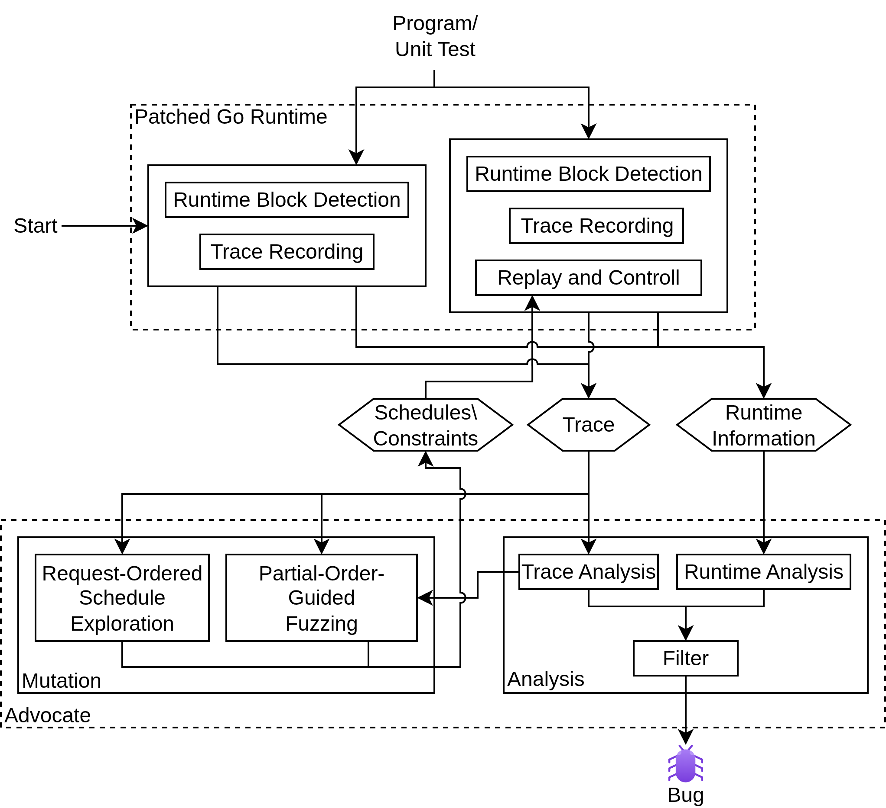

# AdvocateGo

## What is AdvocateGo

AdvocateGo is an analysis tool for concurrent Go programs to detect
blocking and panic bugs.

This branch contains the implementations for the master thesis.
Below you can find a description on how to use the relevant
parts for the thesis.



## Preparing the Environment

AdvocateGo can be used locally or using a docker image. In both cases
the environment must be prepared before use.

### Local

Before Advocate can be used, it must first be build.

There are two elements that need to be build.

#### Runtime

To run the recording and replay for Go, a modified version of the Go runtime
has been provided. It can be found in the [go-path](goPatch/) folder.

Before it can be used, it needs to be build. To do this, move into
[go-path/src](goPatch/src/) directory and run the

```shell
./src/make.bash
```

script. This will create a go executable in the `bin` directory.

#### Advocate

Additionally, the advocate program needs to be build. This is a standard Go
program. To build it, move into the [advocate](advocate/) directory
and build it with the standard

```shell
go build
```

command. This will create an `advocate` executable, which will be used to
run the analysis.

### Docker

To build the docker container, run

```shell
docker build -t advocate-app .
```

This will automatically build the runtime and advocate program.

## Usage

Using it locally, execute the compiled advocate program with

```shell
./advocate -path <pathToProg> [args]
```

To run it using docker, execute

```shell
docker run --rm -it \
  -v <pathToProg>:/prog \
  advocate-app -path /prog [args]
```

where `<pathToProg>` is the global path to the root of the program that should
be analyzed.

### Arguments

There are multiple arguments that can be set. Here we give the most
important once. For a full list run

```shell
./advocate -help
```

- `-fuzzingMode [mode]`: If not set, the partial order guided fuzzing will be
executed. To run the `GFuzz` or `GoPie` fuzzing, add `-fuzzingMode GFuzz` or
`-fuzzingMode GoPie`
- `-main`: In default mode, AdvocateGo will analyze the unit tests within
the given program. To run the main program instead, run with `-main`.
- `-exec` [name]: In default mode, AdvocateGo will iterate over all available
unit tests. To execute only one specific test, run with `-exec [testName]`.
- There are multiple timeouts and maximum numbers. These are
  - `-timeoutRec [in sec]`: timeout for program recording in seconds
  - `-timeoutRep [in sec]`: timeout for execution of mutation in seconds
  - `-timeoutFuz [in sec]`: timeout for full fuzzing in seconds. This is per test.
  - `-maxFuzzingRuns [number]`: maximum number of fuzzing runs
- `-keepTrace`: reduce the memory usage, traces are automatically deleted after the analysis.
To keep the traces set `-keepTrace`
- `-stats`: use this to create statistics

## Output

Running the program will create an output folder `AdvocateResult` containing
all relevant files, including the found bugs.


## Info

> [!WARNING]
> This program currently only runs / is tested under Linux

> [!Warning]
> ADVOCATE is implemented for [go version 1.25](https://go.dev/blog/go1.25).\
> Make sure, that the correct version is installed on your system.\
> Make sure, that the executed programs and tests do not choose another version/toolchain and are compatible with go 1.25\
> The output `package advocate is not in std ` or similar indicates a problem with the used version.
