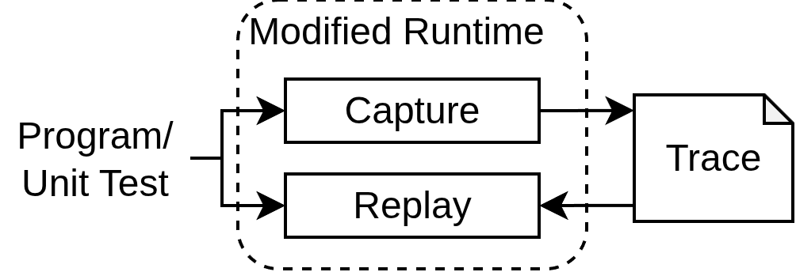
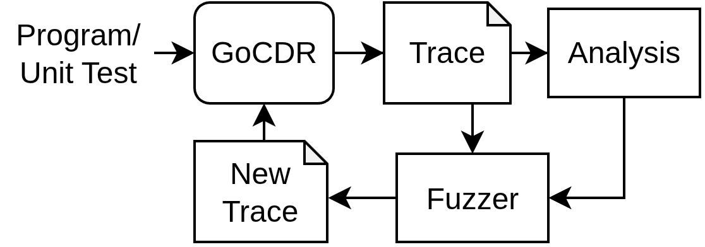

# GoCDR

## What is GoCDR

GoCDR allows the user to record and replay executions of concurrent programs in Go.

It also implements an analysis and fuzzing mode based on the record and replay feature

## Modes

Advocate provides 4 different modes:

- record: record the execution of a program or test into a trace
- replay: given a trace file, execute a program in such a way, that it follows the trace
- analysis: record a program and analyze the recorded trace to detect potential concurrency bugs.
- fuzzing: apply different fuzzing approaches to increase the reach of the analysis.

## Usage

For an explanation on how to use GoCDR, see [here](./doc/usage.md).

> [!IMPORTANT]
> GoCDR is implemented for go version 1.25.
> Make sure, that the program does not choose another version/toolchain and is compatible with go 1.25.
> The output `package GoCDR is not in std ` or similar indicates a problem with the used version.
> It can help to shorten the go version number in the go.mod file of the analyzed program from go 1.25.x to go 1.25.

## Files

The project contains two main directories.
`goPatch` contains a modified version of the go runtime, implementing the capture and replay capabilities.
`gocdr` contains a controller program to run the recording or replay of programs. 

## Documentation

A description of how GoCDR works can be found in the [doc](doc) folder.