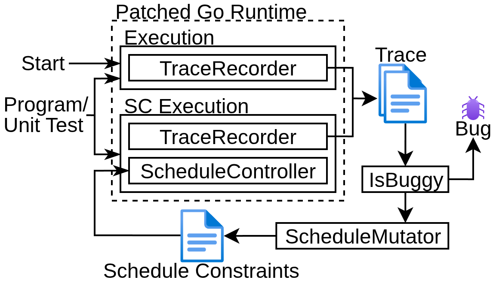
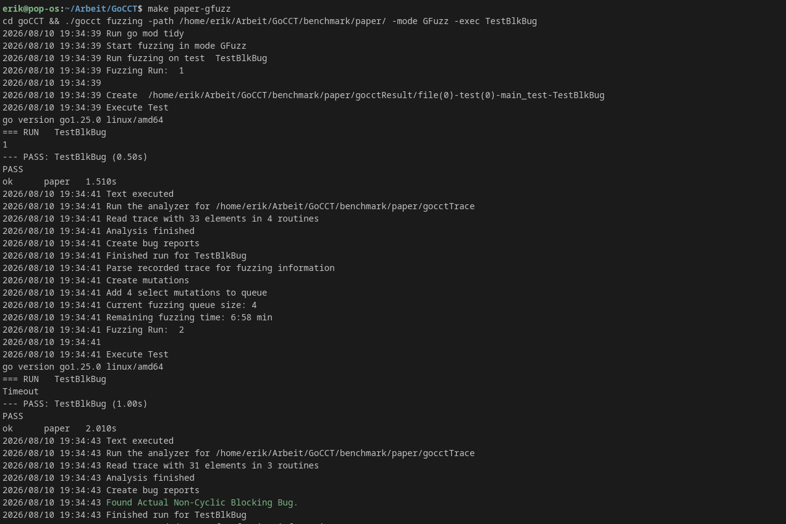

# GoCCT

## What is GoCCT

GoCCT is an analysis tool for concurrent Go programs.
It tries to detects concurrency bugs and gives diagnostic insight.



The Figure above gives a high-level overview of the controlled concurrency testing algo-
rithm employed by GoCCT and its architecture

GoCCT records the trace $S$, i.e., schedule, of concurrent events as they
took place during execution. If some buggy behavior can be detected it is done.
Otherwise, it mutate $S$ to obtain a new schedule $S_{mut}$.
GoCCT then replays the execution of $P$ where it steers execution towards
a schedule that fulfills $S_{mut}$. We continue until we discover some buggy
behavior or some time limit is reached.


## Usage

The following gives a short overview on how to run GoCCT. For a more detailed explanation, see [here](./doc/usage.md).

### Download

First download the program using

```shell
git clone https://github.com/ErikKassubek/ADVOCATE/tree/GoCCT GoCCT
```

On windows, auto-conversion of line endings can lead to problems. You can disable it with

```shell
git config core.autocrlf false
```

After downloading the program move into the downloaded `GoCCT` folder.\
Note: If you have direclty downloaded the repository, the top directory may be called `ADVOCATE`.

### Build

To build the program, run

```Shell
make build
```

For an explanation on how to build the program without using `make`, see [here](./doc/usage.md#build).

### Benchmark

> [!IMPORTANT]
> GoCCT is implemented for go version 1.25.
> Make sure, that the program does not choose another version/toolchain and is compatible with go 1.25.
> The output `package gocct is not in std` or similar indicates a problem with the used version.
> It can help to shorten the go version number in the go.mod file of the analyzed program from go 1.25.x to go 1.25.

We provide a set of benchmark programs, consisting of the GoBench benchmark [^1], a commonly used benchmark for concurrency bugs in Go. Additionally, we include a runner program to execute those programs. GoBench and the runner program can be found in the [benchmark](./benchmark/) directory. It also includes a short explanation on how to run the benchmarks.

To run the benchmark (GoBench), execute 

```shell
make benchmark
```

It will create a `gocctResult` folder within GoBench containing all the results.

The runner program is also able to apply the analysis onto a set of real-world programs. This will clone those programs and apply GoCCT onto there unit test suite. For more information on how to run the real-world programs see [here](./benchmark/Readme.md).

### Example

As an example, we use a slighly modified versions of the first program snippe shown in our RV26 Tool Showcase Submission.
The programs can be found [here](./benchmark/paper/main_test.go).

The test `TestBlkBug` is shown below:

```go
func TestBlkBug(_ *testing.T) {
	ch := make(chan int)
	go func() {
		ch <- calc()
	}()

	select {
	case x := <-ch:
		fmt.Println(x)
	case <-time.After(1 * time.Second):
		fmt.Println("Timeout")
	}
}
```


It contains a select with a timeout. If the timeout case is chosen, the send on the channel is in a blocking bug. This is a good example 
for the GFuzz mutation technique [^2], which modifies the chosen selec cases.

Running the analysis on the program with `make paper-gfuzz` or `./gocct fuzzing -path [path]/GoCCT/benchmark/paper/ -mode GFuzz -exec TestBlkBug` (in goccd), will result in an output similar to the following:



This shows, that during the first run, the first select was executed, leading to a run without a bug. During the second run, the execution
was driven towards executing the second case, therefore leading to the blocking bug, which was correctly detected.

Additionally, in the gocctResult, a `bugs` directory is created, containing an explanation of the bug:

```shell
# Bug: A07 - Actual Non-Cyclic Blocking Bug

During the execution, a blocking bug was detected.
This means, there is a routine that is blocked, and there is not possibility of it being unblocked in the future

## Test/Program
The bug was found in the following test/program:

- Test/Prog: TestBlkBug
- File: /home/erik/Arbeit/GoCCT/benchmark/paper/main_test.go
- Trace: gocctTrace_2

## Bug Elements

The elements involved in the found bug are located at the following positions:

###  Channel: Send

-> /home/erik/Arbeit/GoCCT/benchmark/paper/main_test.go#12

```go 2 
 3 import (
 4 	"fmt"
 5 	"testing"
 6 	"time"
 7 )
 8 
 9 func TestBlkBug(_ *testing.T) {
10 	ch := make(chan int)
11 	go func() {
12 		ch <- calc()                    // <================= 
13 	}()
14 
15 	select {
16 	case x := <-ch:
17 		fmt.Println(x)
18 	case <-time.After(1 * time.Second):
19 		fmt.Println("Timeout")
20 	}
21 }
22 
...
```

### Advanced Usage

To use GoCCT outside the benchmark, or to use the full range of capabilityies, see [here](./doc/usage.md#usage).


## Documentation

A detailed description of how GoCCT works can be found in the [doc](doc) folder.

[^1]: T. Yuan, G. Li, J. Lu, C. Liu, L. Li, und J. Xue, „GoBench: A Benchmark Suite of Real-World Go Concurrency Bugs“, in 2021 IEEE/ACM International Symposium on Code Generation and Optimization (CGO), Seoul, Korea (South): IEEE, Feb. 2021, S. 187–199. doi: 10.1109/CGO51591.2021.9370317.

[^2]: Z. Liu, S. Xia, Y. Liang, L. Song, und H. Hu, „Who goes first? detecting go concurrency bugs via message reordering“, in Proceedings of the 27th ACM International Conference on Architectural Support for Programming Languages and Operating Systems, in ASPLOS ’22. New York, NY, USA: Association for Computing Machinery, Feb. 2022, S. 888–902. doi: 10.1145/3503222.3507753.
