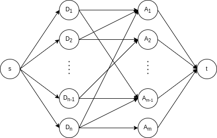

# Done before add

If "done" happens before "add", the waitgroup counter may become negative => panic.

To detect such a situation, we do the following for each wait group:

We try to find an Add $A$ for each Done $D$,
such that $A$ is before $D$ and for each $D$ there is a unique $A$.
We therefore check, if
$$(\forall D\ \exists (D, A): A < D)\ \land\ (\forall i, j\ (D_i \neq D_j \land (D_i, A_i) \land (D_j, A_j)) \Rightarrow A_i \neq A_j)$$

If a done has
a delta which not 1, we treat it,as if it would be delta separate adds.

To see if this is possible we store for every $D$ all $A$ for which $A < D$.
From this we build an bipartite st-graph as follows:

For each Done $D$, there is an edge to the Add $A$ iff $A < D$.
We now assume, that each edge has capacity 1 and use the Ford-Fulkerson
algorithm to find the maximum flow in this graph. A done before add is possible,
if this maximum flow is less then the number of done.
