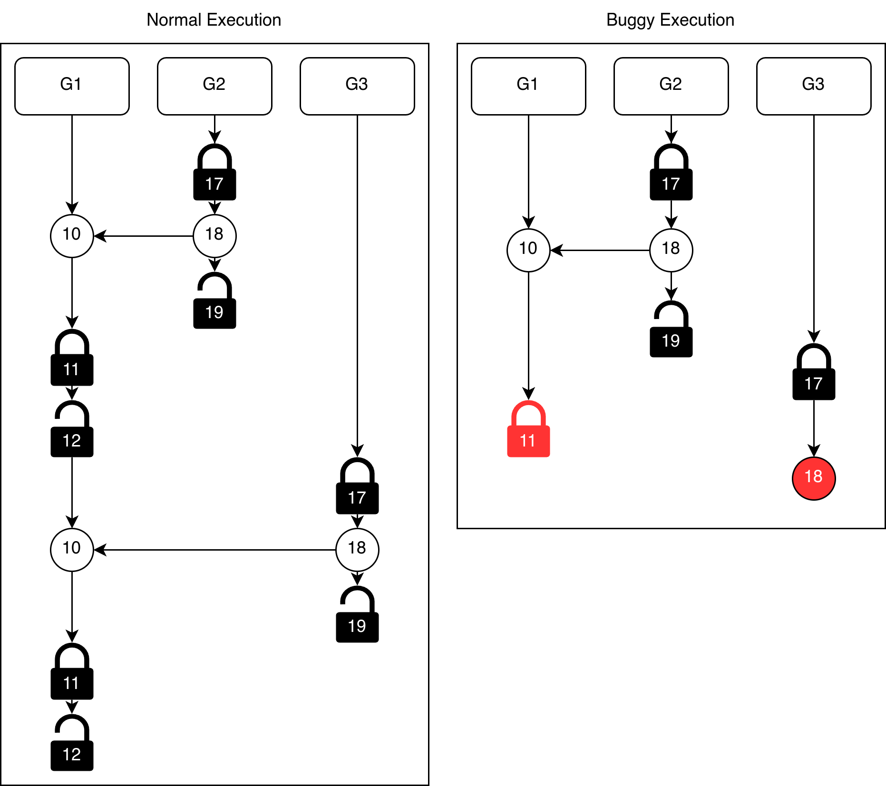

# Order Based Fuzzing

The order based fuzzing is based on [GoPie](../relatedWorks/PaperAndTools/Fuzzing/GoPie.md).

## Idea

The main idea of order based fuzzing is to directly mutate the order of operations in the
program. This may be able to uncover bugs in the program.

### Triggering bugs

The original GoPie implementation is only able to detect bugs, if they actually
occur. Reordering operation may result in bugs directly being executed. To demonstrate
this, we can look at the following simple program.

```go
c := make(chan int, 1)

go func() {
  c <- 1
}

close(c)
```

In this case it is fairly easy to see, that the program contains a potential
send on closed, for actual bugs this might be more hidden.

We assume, that during the first recording run, the trace is as follows

```
     G0         G1
1. fork(G1)
2.            send(c)
3. close(c)
```

GoPie aims at detecting bugs without performing additional analysis, like a
happens before analysis. This is done by reordering operations in the trace.
Those traces are then executed, hoping that they contain a bug. In this case,
a mutated trace that would trigger the bug would look like

```
     G0         G1
1. fork(G1)
2. close(c)
3.            send(c)
```

### Uncovering new execution paths

Another way those mutations may be able to help uncover bugs is by executing no
program codes.

One example here are select cases. We can look at the following example

```go
c := make(chan int, 1)
d := make(chan int, 1)

go func() {
  c <- 1
}

go func() {
  d <- 1
}

select {
  case <-c:
    someCode()
  case <-d:
    codeWithBug()
}
```

If we assume that during the recording run (or, because of some additional code, during nearly all runs)
the trace looks as follows

```
      G0        G1        G2
1. fork(G1)
2. fork(G2)
3.            send(c)
4. select
5.                     send(d)
```

the select will always choose the `c` case in the select, not being able to
detect the bug in the `d` case, since it is not executed.

By running the following reordered trace, the code in the `d` case is executed,
and the bug in this code can be found.

```
      G0        G1        G2
1. fork(G1)
2. fork(G2)
3.                     send(d)
4. select
5.            send(c)
```

Another code snippets where this could help is as follows

```go
var a atomic.Uint64
a.Store(0)

go func() {
  a.Store(1)
}

if a.Load() == 0 {
  CodeWithBug()
}
```

If for the recording the trace is as follows, we cannot detect the bug, since
the if case is false and the function is not executed:

```
      G0              G1
1. store(a, 0)
2. fork(G1)
3.               store(a, 1)
4. load(a)
```

By reordering the trace as follows, the if clause is true, and the new code
can be examined to find the potential bug.

```
      G0              G1
1. store(a, 0)
2. fork(G1)
3. load(a)
4.               store(a, 1)
```

(Note: The original GoPie cannot perform the last example, since it only
records and mutates channel, select and mutex operations. Our [improved implementation](#gopie-1)
is able to also mutate other types of concurrency operations, including atomic operations.)

## Implementation

We implement three different versions of the order based fuzzing.

[GoPie](#gopie) tries to stay as close as possible to the original GoPie implementations
(the implementation of GoPie differs in multiple points from the
description in the [GoPie paper](../relatedWorks/PaperAndTools/Fuzzing/GoPie.md).
Here we stay as close as possible with the ideas of the implementation).

[GoPie+](#gopie-1) adds some improvements to GoPie, including implementing
some of the points that are in the GoPie paper but not in its implementation.

[GoPieHB](#gopiehb) merges the GoPie approach with the [HB analysis], both by
using the HB analysis to detect bugs, that are potentially possible based on
the HB information but not directly triggered, as well as by filtering out
mutations, that are impossible based on the HB information.

### GoPie

This sections describes the original [GoPie](../relatedWorks/PaperAndTools/Fuzzing/GoPie.md),
and how we have implemented this version.

#### Operations

The original GoPie implementation and therefore also our direct
GoPie implementation only consider Channel, Select and Mutex operations.
All other operations are ignored.


#### Fragmentation

To prevent the path explosion problem, GoPie divides the program into
smaller fragments, always only mutating one of them.

Those fragments are called scheduling chain (SC). In the original paper, they are defined as $$SC: \{\langle r_1, p_1, o_1\rangle\, ..., \langle r_i, p_i, o_i\rangle\, ..., \langle r_n, p_n, o_n\rangle\ |\ r_i \neq r_{i+1}, 1 \leq i \leq n-1\},$$
where each triplets refers to one operations. $r_i$ is the routine, where the operation took place.
$p_i$ is the type of primitive, e.g. channel or mutex. $o_n$ is an identifier for the operation, e.g. the line number. In our implementation, we build the chains directly as a slice of trace elements.

The chain stands for the order, in which the operations have been executed.
Additionally, two consecutive triples in a chain must belong to different routines.

We then mutate those scheduling chains. Chains to mutate are created by
randomly choosing two elements with a $Rel_2$ relation (see below.)

Let's look at the following example:

```go
c := make(chan int, 3)
d := make(chan int)

go func() {  // G1
  c <- 1
  d <- 1
  c <- 1
}

<- d
<- c
<- c
```

with the following trace:

```
    G0         G1
1. send(c)
2. send(d)
3.          recv(d)
4.          recv(c)
5. send(c)
6.          recv(c)
```

The chain $\{\langle G0, chan, 2 \rangle, \langle G1, chan, 3 \rangle, \langle G0, chan, 5 \rangle\}$,
meaning the send and receive in d and the second send on c would create a valid scheduling chain,
since all neighboring elements are in different routines, while
$\{\langle G0, chan, 1 \rangle, \langle G0, chan, 2 \rangle, \langle G1, chan, 3 \rangle\}$ is not,
since the first two elements are from the same routine.

#### Relations

During the mutation, we want to assure, that mutated scheduling chains stay
mutated scheduling chains. We therefore define two relations, which tell
us how the mutations can be performed.

We say $\langle c, c'\rangle \in CPOP_1$ if $c$ and $c'$ are operations in the same routine.
We say $\langle c, c' \rangle \in CPOP_2$ if $c$ and $c'$ are operations on the same primitive but in different routines.

To see which mutations on a chain are possible, GoPie defines two Relation between operations. Those relations are defined by the following rules:

- Rule 1: $\exists c, c' \langle c, c' \rangle \in CPOP_1 \to c' \in Rel_1(c)$
- Rule 2: $\exists c, c' \langle c, c' \rangle \in CPOP_2 \to c' \in Rel_2(c)$
- Rule 3: $\exists c, c', c'', c' \in Rel_1(c), c'' \in Rel_2(c')\to c'' \in Rel_2(c)$
- Rule 4: $\exists c, c', c'', c' \in Rel_2(c), c'' \in Rel_2(c')\to c'' \in Rel_2(c)$

where $Rel_{1/2}(x)$ stands for the set in which the operations of primitives are related to $x$.\
Rule 1 indicates, that two neighboring operations executed in the same routine are related.\
Rule 2 indicates, that two operations of the same primitive that execute consecutively in different routines are related.\
Rule 3 and 4 perform transitive inference.

Those relations are later used in the mutator in rule 3 and 4 (see below). They therefore
need to be calculated (do all of them need to be calculated up front or can
we only calculate those when needed $\to$ The transitive inference seems to make it necessary,
that all $Rel_{1/2}$ are calculated up front).

#### Mutation

Given such a scheduling chain, it can be mutated with the following rules:

1. Abridge: This removes an item from the $SC$ (either from head or tail) if there
is more than one operation in it, which helps GoPie to limit the length of an $SC$. $$\exists o_i, o_j \{o_i, o_{i+1},...,o_{j-1}, o_j\} \in SC \to \{o_{i+1},...,o_{j-1}, o_j\} \in SC, \{o_i, o_{i+1},...,o_{j-1}\} \in SC$$
2. Flip: This performes a reverse process on the $SC$ to be mutated. E.g. if $\langle s_1, s_2\rangle$ is covered in the scheduling, $\langle s_2, s_1\rangle$ is also valuable to take a try $$\exists o_i, o_j \{...,o_i, o_j,...\}\in SC \to \{...,o_j, o_i,...\}\in SC$$
The Flip operation is described in the paper, but not implemented in the original goPie implementation.
We assume the reason for leaving it out of the implementation is, that flipping two elements in
a scheduling chain, may result in a chain, that is not a valid scheduling chain, which may lead to
impossible schedules. For this reason, we exclude it in our GoPie implementation, but add it in the [GoPie+](#gopie-1) implementation.
3. Substitute: This tries to replace an operation with another one from the set of $Rel_1$ $$\exists o_i, o_j \in Rel_1(o_i), \{...,o_i,...\} \in SC \to \{...,o_j,...\} \in SC$$
4. Augment: This tries to increase the length of $SC$ by adding another operation from the set of $Rel_2$ to its tail, which aims to explore those effective interleaving in a further step. $$\exists o_j, o_j \in Rel_2(o_i), \{...,o_j\}\in SC \to \{...,o_j, o_j\}\in SC$$

Given a chain `c`, we construct the new mutated chains as follows

```go
res := make(map[string]chain)
res[c.toString()] = c

for {
  for _, ch := range res {
    tset := make(map[string]chain, 0)

    // Rule 1 -> abridge
    if ch.len() >= 2 {
      newCh1, newCh2 := abridge(ch)
      tset[newCh1.toString()] = newCh1
      tset[newCh2.toString()] = newCh2
    }

    // Rule 2 -> flip (in paper, but not in original implementation)
    // therefore in GoPie+ and GoPieHB, but not in GoPie
    if fuzzingMode != GoPie {
      if ch.len() >= 2 {
        newChs := flip(ch)
        for _, newCh := range newChs {
          tset[newCh.toString()] = newCh
        }
      }
    }

    // Rule 3 -> substitute
    if ch.len() <= BOUND && rand.Int()%2 == 1 {
      newChs := substitute(ch)
      for _, newCh := range newChs {
        tset[newCh.toString()] = newCh
      }
    }

    // Rule 4 -> augment
    if ch.len() <= BOUND && rand.Int()%2 == 1 {
      newChs := augment(c)
      for _, newCh := range newChs {
        tset[newCh.toString()] = newCh
      }
    }

    for k, v := range tset {
      res[k] = v
    }

    if len(res) > MUTATEBOUND {
      break
    }

    if (rand.Int() % 200) < energy {
      break
    }
  }
}
```
with `BOUND = 3` and `MUTATEBOUND = 128`.

The number of chains created is determined by the energy, which itself is
based on a score depending on the recorded run. The score is
calculated as $\#w_1 * Rel_1 + w_2 * \log(Rel_2)$
based on the number of pairs of elements in $Rel_1$ and $Rel_2$ with wights $w_1$ and $w_2$.
If the run the mutation is based on was not successful,
e.g. because it ran into a timeout, the score is set to 0 and
no mutations are created based on this run.\
The energy is then the percentage of this score compared to the maximum score over all runs.

GoPie does not create new scheduling chains based on new runs. Instead it
only chooses a scheduling chain on the first run (but starts the whole process multiple times).
This scheduling chain
is then mutated, and the mutations based on them are run. When a mutation
was run, GoPie will check if the run was interesting, by determining, whether
the scheduling chain was actually run. If it was not scheduled, the run is ignored
for further mutation. If the run was successful, it will be used to
create new mutations, but instead of choosing new mutations, only the
original chain, that was used for the recording, is again mutated further.
The only additional information used is that `Rel_{1,2}` are newly calculated
based on the new run.

The reason for this is probably the limited order enforcement, which
only enforces the order of the elements in the scheduling chain, but not for
any other operations (see [below](#order-enforcement)).

#### Analysis

The analysis of the original goPie implementation is interested in finding
panic bugs and routine leaks, including deadlocks.

To detect panics, it determines if a program run panicked, by checking
if the output of the run contains the string `panic`.

To detect leaks, it relies on two methods. First is the internal check
for total deadlocks in the runtime. If all routines in a go program
are blocked, the runtime panics. This is detected by checking if the output
contains `all goroutines are asleep - deadlock!` string. Additionally, it
uses the [GoLeak](../relatedWorks/PaperAndTools/Analysis/GoLeak.md) tool,
to check for routines from a test that are still running, after a test has
concluded.

Instead of following this approach, we use our own detection for detecting
[leaks](../analysis/leak.md), [total deadlocks or panics](../analysis/panics.md).
Implementing these detection mechanisms may have been possible but, especially
for the inclusion of GoLeak, unnecessary laborious. Since our approaches can
detect the same situations as those tools and approaches, we used our own.

#### Order Enforcement

The order enforcement or replay mechanism of the original GoPie implementation
used is similar to the replay mechanism implemented by us.
For a tracked operation, it creates a wait and release mechanism.
The main difference is, that GoPie only enforces the order of a subset of
all operations, namely the operations in the mutated scheduling chain. Those operations
are called active operation.

It the program wants to execute an operation, it first checks if the operations
is active. If it is not, the operation can directly be executed. If it is active,
it will be checked, if the operation is the next operation that is to be executed.
If it's not, the execution of the operations is stopped, until it is the next
operations. If it is the next operation, it is executed. The program will
continue with the next active operations only if the previews one has send
back an acknowledgement.

We implement this by adding the option for active and inactive operations to
our replay system. All operations that are inactive are released
directly. All active operations are treated like in the normal replay mechanism.

Limiting the enforcement of the execution order has the advantage of a besser
performance in the execution. But it also has negative consequences.\
It is possible, that during the execution of a mutation the program diverts
from the originally recorded path before it reaches the program part with the
scheduling chain, therefore never executing the chain, making the run a waist
of time and resources (one can argue that in this case we still 'explored' a
new path, which is ultimately what we want, but it was not done in the way
we wanted to).

This limited order enforcement may also be the reason, why the same scheduling chain
is mutated over and over again, instead of choosing new scheduling chains in
runs based on a mutations. If the part of the program was reached during
the first, non enforced, run, it is likely that it will reach this part again
in a further run. This makes it possible to still reach the point of the mutation
with a fairly high probability. But if we would no create a new scheduling chain,
at a code position which could only be reached because of the mutation,
it is unlikely to be reached again, if we only force the order of this new chain,
but not the previous chain.

#### Differences to original implementation

We have implemented the described implementation into our Advocate framework.
The implementation therefore differs from the original GoPie implementation.

The main change is that the original GoPie implementation needs to instrument
the tested source code to implement the recording and replay.
In our implementation, this is all directly added into the
implementation of the relevant operations as described in [recording](../recording.md)
and [replay](../replay.md).


### GoPie+

In the GoPie+ implementation we improve multiple points compared to the
original GoPie implementation. In this step we do not use our HB information.

We improve the following points:

1. We use all recorded operations during mutations, not just channel and mutex
2. The original implementation only chooses a set of scheduling chains on the first run, mutating them over and over, we also pick new chains after each mutation run
3. We implement the Flip mutation described in the paper but not implemented in GoPie
4. We include started but never fully executed operations in our mutations.
5. We improve the replay by performing order enforcement for all operations before the scheduling chain
6. We exclude scheduling chains that have been executed multiple times before, or chains, that only contain one element.

#### Operations

Instead of just considering and mutating Channel, Select and Mutex operations,
GoPie+ also considers all other operations that are recorded
in our trace.

#### New Chains

If a mutation is executed, GoPie does not choose new points of interest
from the new trace to be executed, but only continues to execute the
original chain. This is a limitation, that can prevent a bug that can only
be triggered if multiple positions are mutated at the same time from being discovered.

We change this for GoPie+. When a mutation was run, we choose new random
scheduling chains based on this trace, to create new mutations. This
will increase the number of mutations, but increases the probability of
uncovering more complex and unlikely, but still possible bugs.


#### Flip

The first point is the already mentioned flip mutation. For an
unknown reason, the Flip operation is not present in the original GoPie
implementation (we assume that is was an implementation oversight, since the
implementation at multiple points seems unfinished, including multiple
never implemented TODO notes). We include the flip operation in GoPie+.

All chains start as a random pair of two elements with Rel2. The length of a
chain can only be increased by the augment mutation. In the implementation,
the augment mutation can only be applied if the chain has a length of at most
3, meaning we can never have a scheduling chain with more than 4 elements
(for some reason this limit is also at substitute). Since only neighboring
elements in a scheduling chain can be flipped, there are at most three possible
flip mutation of a scheduling chain:

```
[a,b,c,d] => {[b,a,c,d],[a,c,b,d],[a,b,d,c]}
```

Those transformation can also be achieved by applying the other rules, e.g.
by repeatedly applying abridge and augment.

This means, that with enough runs, the fuzzing will get the same runs with or
without the flip. But since the number of mutations is limited, and since
the flip should be the mutation that has the highest likelihood of uncovering
new behavior, the implementation with the flip discover paths with bugs with
fewer runs and more often. We therefore think it useful to include the flip
operations.

#### Pre

GoPie only mutates operations that have fully executed, meaning
in the case of a leak, the leaking operation cannot be mutated.
Since we record those leaking operations, we are able to let them
be part of the mutation. With this we may be able to unblock the leak,
therefore accessing new code. An example would be the following program:

```go
m := sync.Mutex{}
c := make(chan int, 0)

go func() {
  c <- 1              // send 1
  codeWithBug()
}

go func() {
  c <- 1              // send 2
s}

<- c
```

If we assume that the `send 2` communicated with the recv, and the `send 1`
blocked, the program did not execute the `codeWithBug`. By making the
not executed send available for mutation, it may change the order of the two
sends, therefore executing the `send1` and the `codeWithBug`, enabling
us to detect the bug.

For the implementation of the scheduling chains, we assume the
operations without a post counter to have a timer equal to there pre counter.


#### Order Enforcement

In the execution of a mutation, GoPie only controls the execution order
of Channels, Selects and Mutexes that are part of the scheduling chain.

This may lead to the execution missing the mutated sections. An examples
for this would be the following program:

```go
m := sync.Mutex()
n := sync.Mutex()
o := sync.Once()

go func() {
  o.Do() {func() {           // Do 1
    m.Lock()
    // the mutated section
  }}
}

o.Do() {func() {            // Do 2
  n.Lock()
  // ...
}}
```

If in the recording execution `Do 1` was first, but in the second, controlled
run the `Do 2` is executed, the mutated section will not be executed.

Another, similar situation would be as follows:

```go
m := sync.Mutex()
n := sync.Mutex()
x := atomic.Uint32

go func() {
  x.StoreUin32(0)
}

x.StoreUin32(1)

if x.Load() == 0 {
  m.Lock()
  // the mutated section
} else {
  n.Lock()
  // ...
}
```

Here the execution of the mutated section depends on the order
of the concurrent stores on the atomic variable `x`.

We fix reduce the probability this problem by using the implemented full
replay as much as possible. It would be difficult to directly include the
mutated order of the operations back into the trace, especially because
the operations do not need to be consecutive. For this reason we split the
replay into two parts. We first use the recorded trace to perform the fully
guided replay. As soon as we reach the first operation in the scheduling chain,
we switch to the replay version described in GoPie, where we only force the
order of the elements from the scheduling chain (the active elements), while
letting all other operations run freely. It is still possible, that this leads
to program runs getting stuck, even if the mutation describes a theoretically
possible execution, but the possibility of this is minimized.

#### Superfluous chains

GoPie does not filter its mutation. This leads to situations, where
scheduling chains with a length of 1 are executed. Those chains
have no influence on the execution of the program. We therefore skip such chains.
Additionally, it can happen, tha the same chain is executed over and over
again. Since it has limited value to execute the same chain over and over again,
we limit the number of how often the same chain can be executed.

### GoPieHB

For GoPieHB, we use the happens-before analysis in GoPie. With this, we are able to
reduce the number of runs the fuzzing needs to find potential bugs.
As a basis, we use our GoPie+ implementation.

The HB data is used in two ways:

#### Analysis

GoPie can only detect concurrency bugs, when the bugs are directly triggered.
Using our predictive analysis, we can detect bugs even if they are not
directly triggered.
s
#### Mutation

A downside of the mutation approach, especially using all concurrency operations,
is, that it creates some mutations, that are not possible to be executed.


Let' e.g. look at the following simple example:

```go
m := sync.Mutex{}

go func() {
  m.Lock()
  m.Unlock()
}

m.Lock()
m.Unlock()
```

We assume that, during the execution, the order was as follows

```
     G0        G1
1. fork(G1)
2.            lock(m)
3.            unlock(m)
4. lock(m)
5. unlock(m)
```

Since `3` and `4` are operations on the same primitive but on different
routines, they are related under `Rel2`. Since they are also on different routines,
$\langle 3, 4\rangle$ form a valid scheduling chain. Using the flip
operations, we can create $\langle 4, 3\rangle$ as a scheduling chain.
Executing this chain would lead to the execution getting stuck, since `4`
would not be able to execute.

Since based on the Lampert-HB relation, critical section cannot be reordered,
it can be seen directly from the HB relation, that this run will not successfully
execute and we therefore do not need to execute it.

The original goPie implementation has no way to detect those impossible schedules
and will try to replay them, resulting in an stuck replay. GoPie will not create
new mutations from those failed runs or will be able to draw any conclusion from
them, but since those schedules are still replayed, they increase the number
of runs and therefore the runtime.

We can use our HB relation to directly check for schedules, that
violate the relation, To do this, we first create all mutation from a given schedule.
We then traverse all proposed mutations and remove all impossible once.

This can reduce the number of created mutations and therefore the runtime.


### Example

The following is an example on how this can lead to a bug being triggered.
The example is a simplified version of the Kubernetes bug presented in the
[GoPie](../relatedWorks/PaperAndTools/Fuzzing/GoPie.md) paper.

We assume the following program

```go
// simplified mixed deadlock from Kubernetes
// simplified from GoPie paper
var (
	m = sync.Mutex{}
	c = make(chan bool)
)

func R1() {
	for i := 0; i < 2; i++ {
		<- c             // 10
		m.Lock()         // 11
		m.Unlock()       // 12
	}
}

func R2() {
	m.Lock()           // 17
	c <- true          // 18
	m.Unlock()         // 19
}

func main() {
	go R1()            // G1
	go R2()            // G2
	go R2()            // G3
}
```

This can have different interleaving. Depending on the interleaving, this can
lead to a mixed deadlock. The following image shows two possible interleavings,
one which contains a bug (on the right) and one that does not contain the bug.

<center></center>

The shown number are the line numbers in the program. The locks show the
mutex lock and unlock operations. The circles show channel send and receive.

By starting with a scheduling chain consisting of the unlock in G2 (19) and
the first lock in G1 (11), we can show, how we get to the buggy execution.

| Step | Mutations | Scheduling chain |
| --- | --- | --- |
| Init | - | $\{\langle G2, 19\rangle, \langle G1, 11 \rangle\}$ |
| Step 1 | Substitute | $\{\langle G2, 18\rangle, \langle G1, 11 \rangle\}$ |
| Step 2 | Substitute | $\{\langle G2, 18\rangle, \langle G1, 12 \rangle\}$ |
| Step 3 | Abridge | $\{\langle G2, 18\rangle, \langle G1, 12 \rangle, \langle G3, 17 \rangle\}$ |
| Step 4 | Flip | $\{\langle G2, 18\rangle, \langle G3, 17 \rangle, \langle G1, 12 \rangle\}$ |
| Step 5 | Substitute | $\{\langle G2, 18\rangle, \langle G3, 17 \rangle, \langle G1, 11 \rangle\}$ |