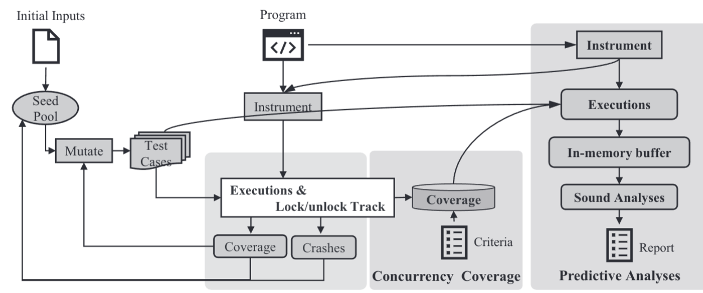

# Sound Predictive Fuzzing for Multi-threaded Programs

[Y. Guo et al., "Sound Predictive Fuzzing for Multi-threaded Programs," 2023 IEEE 47th Annual Computers, Software, and Applications Conference (COMPSAC), Torino, Italy, 2023, pp. 810-819, doi: 10.1109/COMPSAC57700.2023.00110.](https://ieeexplore.ieee.org/document/10196976)

## Summary

The paper presents a framework based on an existing fuzzing technique,
AFL++, to integrate the predictive techniques for effective concurrency vulnerability detection.
For every input (the original and the mutated ones), they call a predictive tool such that, even if a concurrency vulnerability is not really triggered, it can be predicted.
To overcome heavy efficiency challenges existing in predictive tools, they propose to selectively call a predictive tool based on concurrency coverage criteria.They use [SEQCHECK](./SoundAndEfficientConcurrencyBugPrediction.md) and adapted it to propose build PREDFUZZ.

The first module decides whether an input should be passed to the second module for vulnerability prediction (no matter whether the input can bring new coverage defined in AFL++ or not). The second module accepts the original program under test and input from the first module. Next, it calls SEQCHECK to run the program against that input and to conduct subsequent analysis. If SEQCHECK reports any concurrency vulnerability, PREDFUZZ reports it.

PREFFUZZ uses Lock/unlock coverage to determine wether an input should be passed to prediction. This coverage is defined as:

> Given two executions, let $s = \langle e_1, e_2, ....e_n\rangle$ and $s' = \langle e'_1, e'_2, ....e'_n\rangle$ be two sequences of lock/unlock operations (i.e., $e_i/{e'}_i$ has the form $\langle lock/unlock, l\rangle$ where $l$ is a unique location identifier where the operation $e$ occurs) from two executions $p$ and $p'$, if we have $e_i \neq e'_i$, then the two executions $p$ and $p'$ have different lock/unlock coverage.