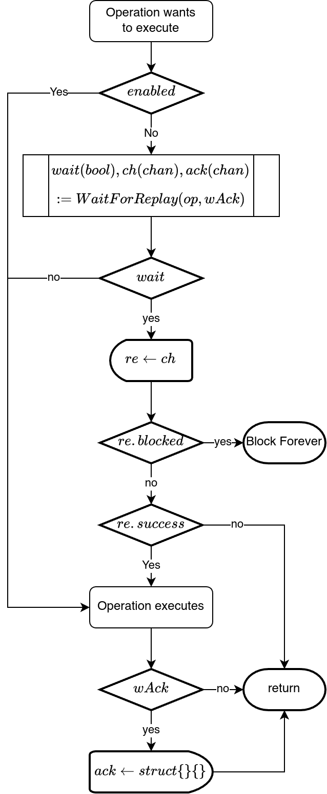
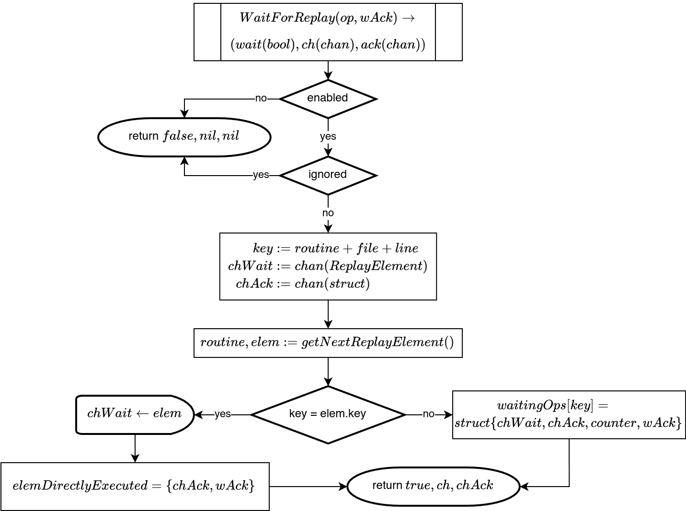
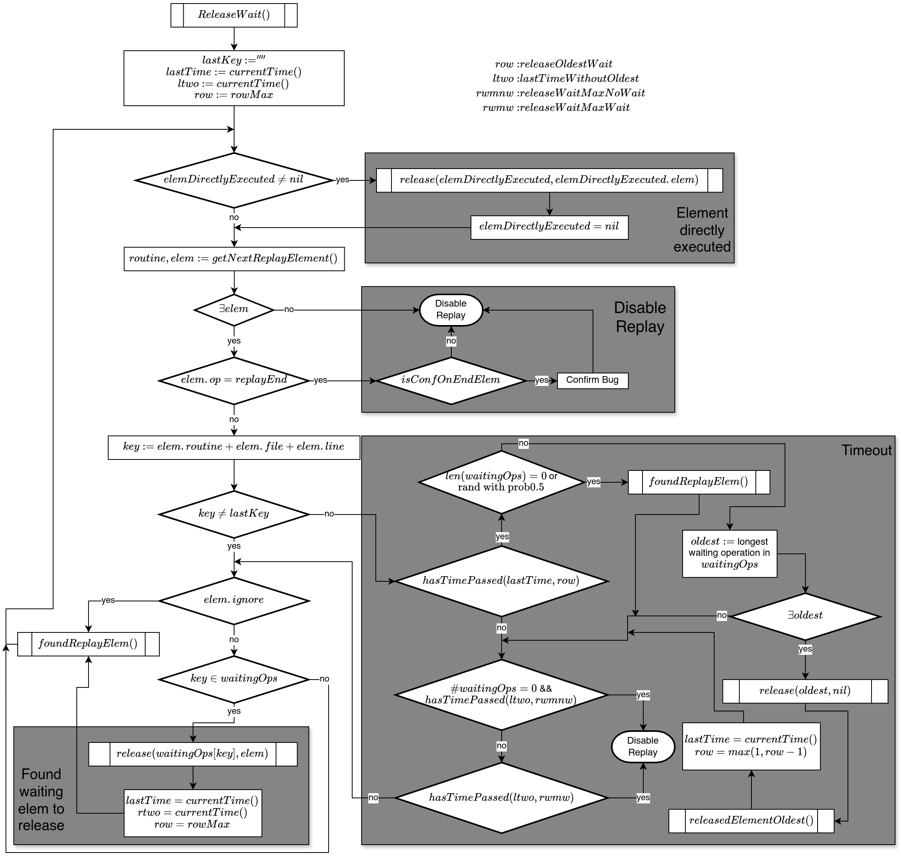
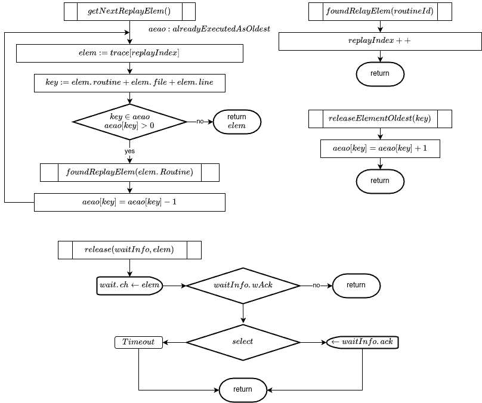

# Replay

Here we will explain the strict replay, that forces the program to exactly follow a given trace.

We have also implemented some more relaxed execution path
influencing systems, used mainly for the different fuzzing
approaches. You can find these, [here](./fuzzing/Flow.md#implementations) and [here](./fuzzing/GFuzz.md#implementation).

## Implementation
The following is a description of the implementation of the trace replay.

First we will give an [overview](#overview) over the replay mechanism. Then
we will give an [detailed explanation](#detail) of the implementation.
<!-- At the end we will illustrate the mechanism with an [example](#example). -->

### Replay Mechanism

The replay is implemented as an wait and release mechanism.

When an operation wants to execute, it checks if it is the next operation
in the trace. If it is, it will execute. If not, it will wait until it is the
operations turn.

There are two main parts in this mechanism, the operation and the replay
manager. The operations wants to execute, and if it is not the next element
to be executed, it will wait. The replay manager runs in the background to
release all waiting operations.

The replay in the operation works as follows:

```
If the operations is an ignored (internal) operation,
execute directly.
See (E1)

Get the next element in the trace.
See (E2)

If current operations matches next event,
then executed and send a direct acknowledgement
to the manager.
See (E3).

Otherwise, suspend operation and store signal
to wake-up (suspended) operation in map.
See (E4).

When wake-up signal is triggered, execute.
See (E5).

After execution, send an acknowledgement
to the manager.
See (E6)

func operation(op) {
	if ignored(op) {  // (E1)
		execute(op)
		return
	}

	evt = headEvt()  // (E2)
	if match(op, evt) {  // (E3)
		execute(op)
		ackDir()  // (E6)
	} else {
		sig = suspend(op)  // (E4)
			waitMap[op] = sig
		if sig.ok {  // (E5)
			execute(op)
			ack()  // (E6)
		}
	}
}
```

The replay manager runs in a background routine and is implemented as followed
(here we ignore the timeout mechanism. For details on this, see the [detailed](#detail) explanation):

```
Get the next element in the trace.
See (M1)

Check if the next element in the trace has been directly
executed (ackDir). If this is the
case, and it is not a channel, wait for the operation
to fully execute (wait for ack). Then advance the trace to the next element.
See (M2)

If the next operation corresponds to an
already waiting operation in a map, send the
signal to release it and remove the operation
from the waitMap.
See (M3)

If it is not a channel communication or select, wait for the operation
to fully execute (wait for ack).
See (M4)

Advance to the next operation in the trace.
See (M5)

func replayManager() {
	while(replayInProgress()) {
		evt = headEvt()  // (M1)

		if hasRelDirectly() {  // (M2)
			if !isChannel(evt) {
				waitAck()
			}
			nextEvt()
		}

		if sig, ok := waitMap[evt]; ok {  // (M3)
			release(sig)
			delete waitMap[evt]

			if !isChannelCom(evt) {  // (M4)
				waitAck()
			}

			nextEvt()  // (M5)
		}
	}
}
```

To determine if an trace event corresponds with an operation, we
use the routine number in the replay trace and the file name and line number
of the operation in the case. We can directly connect the spawn events
in the trace with the executed operations by there file name and line number,
as well as the order in which they execute. When we release a routine spawn,
we store the corresponding trace number in this routine. We can now use this
operation, the position information and the order to uniquely identify each operation.

#### Acknowledgement

The implemented acknowledgements are necessary to prevent situations like the following:

Assume we have the following program code
```go
var o sync.Once

go func() {     // R1
	o.Do(f1())  // Do 1
}

go func() {     // R2
	o.Do(f2())  // Do 2
}
```

Only one of the `do` operations will execute its argument function. Assume in the replay, we have first executed both `go` statements and now want to execute first the `Do 1` and then the `Do 2`, therefore executing `f1` but not `f2`. If we release `Do 1` and then directly release `Do 2`, we can get the following situations. Since go routines do not directly correspond to hardware threads, it is possible that both routines are mapped to the same thread. Lets assume, the underlying thread first executes the replay release on `Do 1`, but before the `Do 1` can be executed, the scheduler switches to routine 2. Here the `Do 2` is released and then executed, therefore running `f2`. Then the scheduler switches back to the first routines, running `Do 1`. Since the once `o` has already executed a function it will not execute `f1`. Additionally, if `f2` contains operations which are effected by replay, the routine will get stuck, since the replay mechanism will never release them.

Similar situations can be constructed for situations, where operations with different execution times are executed directly next to each other. It the longer operation is executed first, it could happen that the next element, which executes much faster effectively executes first, even though it should have executed second.

To prevent this, we use an acknowledgement. When an operation is released, the replay manager will pause. When the operations is completed, it will send an acknowledgement to the replay manager. Only when the acknowledgement is received, the current element will be advanced to the next element in the trace, meaning the next element can only be released when the previous operations has fully executed.

For most operation this works, since they can be executed consecutively. The only operation where this does not work are the channels. Assume we have the following code:
```go
c := make(chan int, 0)

go func() {
	c <- 1
}

<- c
```
If we would wait for the send to fully execute and send an acknowledgement before we release the receive, the program would get stuck, because the send and the receive need to execute at the same time. We therefore do not wait for acknowledgements on channel communication operations and selects (M4).

### Detail

The code for the replay is mainly in [advocate/advocate_replay.go](../go-patch/src/advocate/advocate_replay.go) and [runtime/advocate_replay.go](../go-patch/src/runtime/advocate_replay.go) as well as in the code implementation of all recorded operations.

[advocate/advocate_replay.go](../go-patch/src/advocate/advocate_replay.go) mainly contains the code to read in the trace and initialize the replay. When reading in the trace, all trace files are read. The internal representation of the replay consists of a `map[int][]ReplayElement` `replayData`. For each of the routines, we store a slice of `ReplayElement`, meaning the list of elements in this routine.
The lists are sorted by the `tPost` time stamp. Each `ReplayElement`
represents one operation that is to be executed. It contains data about
the type of operation, the timestamp and the position of the operation
in the file. This position is used to connect the `ReplayElement` to the actual operation during the execution. Additionally it may contain
information about wether the operation is blocked, meaning it should start but never finish or wether it should execute successfully, e.g. for `once.Do` and `TryLock`. For selects, it also contains the internal
index of the case that should be executed.

[runtime/advocate_replay.go](../go-patch/src/runtime/advocate_replay.go) contains the functions for the actual order enforcement.\
The basic idea is as follows: When a operation wants to
execute, it informs the replay manager that it wants to execute. It will then wait until the manager clears it to run. The manager will clear the operations in the order
in which they appear in the trace. In most cases, the manager will then wait
for an acknowledgement from the operation, that it has finished executing.
For channel send/recv we do not wait for an acknowledgement, since here multiple
operation need to be executed at the same time. For the `Do` in a once,
we do not wait for the full operation to be executed to return the
acknowledgement. Instead, we send it after the `Do` has decided whether it will
execute its parameter function, but before this function is executed (if it is
executed). The is necessary because of the following situation:

```go
o := sync.Once{}
m := sync.Mutex{}

o.Do(func() {
	m.Lock()
})
```
We need to first start run the `Do`. Then the `Lock` operation must be
fully executed. If we would wait for an acknowledgement of the `Do`, the
replay of the `Lock` would block, since it must be executed, before the
`Do` finishes and therefore could send its acknowledgement.

To prevent the replay from getting stuck, the manager is able to release operations out of order if it thinks, something went wrong.\
The Order enforcements consists of the operation and the replay manager. First, we have the code in operations itself, that blocks the execution of the operation, until its released by the replay manager.\
The manager will release the operations in the correct order.

#### Flow
##### Replay in operations
<center></center>
<center></center>

When a operation wants to execute, it will call the `WaitForReplay` function. The arguments of the function
contain information about the waiting operation (type of operation and
skip value for `runtime.Caller`) as well as information about wether the
operation will send an acknowledgement (`wAck`) or not. The function
creates a wait channel `chWait` and and acknowledgement channel `cka`, each with
buffer size 1.\
The function then checks, if the operation is part of the replay.
If it is not, either because replay is disabled or because the operation is
an ignored (internal) operation, the function will return and inform the
operation, that it can immediately execution.
If this is not the case, the function checks, if the calling function is the
next element in the trace. If this is the case, it will directly send the
`replayElement` from the trace over the `chWait` channel, to
directly release the operation. The `replayElement` also contains information
whether the manager expects an acknowledgement (`wAck`).
Otherwise it will store those channels with a reference to the code location and routine
id of the operation in a map `waitingOps`. The routine id is the id of the
routine in the replay trace. It is set for the routine in the [newProc](../go-patch/src/runtime/proc.go#L5057) function in `runtime/proc.go`. This allows us to separate
operations in the same code position but in separate routines. Code at the
same code position and in the same routine does not need
to be separated, since routines are executed sequentially. The function then
returns the channels to the waiting operation.

The operation will then start to read on the the `ch` channel. When the manager clears the
operation to run, it will send a message over this channel. This
message, contains information about wether the operation blocked and wether
it was successful. If it should block (tPost = 0), it will block the operation
forever. If the operation was not successful (only possible for once.Do or Try(R)Lock), it will force the execution of the operation to follow this behavior.
Otherwise it will now execute the operation. When `wAck` is true, the
operation will send an empty message as soon as the operation is finished
(normally implemented by `defer`). This allows the manager to release the
next operation.


##### Replay Manager
<center></center>
The replay manager releases the operations in the correct order.

To release the operations, a separate routine `ReleaseWait` is run in the
background.\
This routing loops as long as the replay is active.
The main loop of this manager is as follows:\
First the manager checks, if an operation has executed directly
without it being added to the `waitOps` map first. If this is the case,
it will, if required, check if the operation has already send its acknowledgement.
If not, it will wait for it. If the acknowledgement has arrived, it will
advance to the next element in the trace.\
Then, the manager gets the next element that should be executed (see [here](#getnextreplayelement)).
If no element is left, the replay is disabled.
The same is true if the next element in the trace is the `replayEnd` element.
If the bug is confirmed by reaching a certain point in the code (e.g leak or
resource deadlock), this will confirm the replay. If the element is an
operation element, the manager will check if the element should be ignored
for the replay. In this case, there is no waiting operation and the
manager will simply assume, that the operation was executed and will continue
the loop from the beginning. If this is not the case, the it is checked, if the
operation is already waiting. If this is the case, it is [released](#release).
After that, the manager will continue the loop to get the next trace element.
If the operation is not yet waiting, the manager will directly restart the
loop without advancing to the next replay element, until the operation is
waiting.

It is possible, that in the replay or the rewrite something went wrong
and there are a small number of trace elements, that cause the replay to get
stuck. To still get a chance that is may resolve itself, the manager
is able to release the longest waiting operation, if it senses that the
replay is stuck. This will be done, if the next replayElement is the same for
a too long time. In this case, the replay will trigger the timeout mechanism.
In this, either the oldest element in `waitOps` is released
or the next element in the trace is skipped. We choose one of them at random.
We hope that this will clear the
blockage, so that the replay can continue to be executed. This can be disabled
by setting the `-strictRep` flag in the toolchain.

If no element has been cleared regularly
for a certain time, the replay will assume that it is stuck and cannot be
brought back by releasing the oldest waiting elements and will therefore
disable the replay completely, meaning the program will continue without
any guidance (all waiting operations are released). If the replay is already
far enough, this may still result in the program running in the expected bug.
For more information see the bottom left corner of the flow diagram.

##### getNextReplayElement
The trace is stored in a map. Each entry contains the elements for one routine as a sorted list. Additionally, we have a map `replayIndex` with the same key. The values of this map contain for each routine the index of the first element in the trace list, that has not been executed yet. We now iterate over all routines that have elements that have not been executed yet. For each
of those traces we check the first element that has not been
executed yet and choose the one with the smallest time value
as the next element to be executed.\
When the replay manager releases an oldest element, we need to
make sure, that when this element is returned as the
next element to be replayed, we skip it, since it already has been executed. We therefore have an map `alreadyExecutedAsOldest` from the element key to a counter. This counter contains how often the element has been executed without it being the next element. If this value for the
next element to be replayed is not 0, we will advance the `replayIndex` for the routine, reduce the value of `alreadyExecutedAsOldest` of the element by 1 and call the `getNextReplayElement` function again, to get the next element to be executed.


##### release
To release a waiting element, we send the element info over the corresponding
channel, on which the operation is waiting. If an acknowledgement is expected,
the release function will then read on the acknowledgement channel until
the acknowledgement is received. To prevent a failed acknowledgement from
getting the replay stuck, we have a timeout. If no acknowledgement has been received
after a certain time, we continue the replay anyways. To prevent the case,
where an operation ties to send an acknowledgement after the timeout has been triggered
and therefore cannot send, we set the buffer size of all acknowledgement
channels to 1. They can therefore also send if no one is receiving any more.

##### foundReplayElement/releasedElementOldest
If a replay has been released, the `replayIndex` value of the corresponding
routine is advanced by one. If an oldest replay element was released without
it being the next element, the `alreadyExecutedAsOldes` counter for this element
is increased by one.



#### Select
While most operations are fully determined by the order in which they are executed,
this may not be the case for selects. Here we need to determine which case
the replay should execute. For this an alternative implementation of the
[select structure with a preferred case](../go-patch/src/runtime/select.go#L151) has been implemented.

In the [original implementation](../go-patch/src/runtime/select.go#L629), the select has three phases. In the
first phase the code iterates over all cases and checks, if one of then can
immediately be executed.\
If this is the case, it is executed and the select returns. If this is not
the case, it is checked if there is a default case. If there is, it is executed.
If not, the select start its second phase. Here all channels in all the cases
enqueue the corresponding operations. The routine then parks, until
it is woken up by some routine that wants to communicate with one of the channels.
The communication is then executed. In the third phase, all communications
that have not been executed are dequeued again.

For the select with preferred case, the following changes have been made.
In the first pass we only check the case, where the internal index `casi`
is equal to the preferred index. If the default case is the preferred index,
we don't do anything here.\
If the preferred case is the default case, we directly execute the default case.\
In the second pass, we only enqueue the preferred case.

Similar to release of the oldest waiting element, we also want to release the
wait on the select if the runtime senses, that the replay may be stuck. For
this reason, we implement a `gopark` function with a timeout, that
automatically wakes it up after a certain time. The park with timeout is implemented
in [prog.go](../go-patch/src/runtime/proc.go#L439) as follows:
```go
func goparkWithTimeout(unlockf func(*g, unsafe.Pointer) bool, lock unsafe.Pointer, reason waitReason, traceReason traceBlockReason, traceskip int, timeout int64) {
	mp := acquirem()
	gp := mp.curg

	// Setup timer if timeout is non-zero
	if timeout > 0 {
		go func() {
			sleep(float64(timeout))
			if readgstatus(gp) == _Gwaiting {
				goready(gp, traceskip)
			}
		}()
	}

	// original gopark implementation
	...
}
```
The additionally routine will wake the sleeping routine if the timer
runs out before it is awoken by a communication partner.

When the routine is woken up by a communication partner, we do not need to
pass the third phase, since there are no more waiting channel in the select.
In this case the select returns. If it was awoken by the timeout, we dequeue
the waiting channel operation and return. In this case, the select is run again,
now with the original implementation, meaning without any guidance.

Selects with only one case and a default are implemented separately in go ([here](../go-patch/src/runtime/chan.go#L990) and [here](../go-patch/src/runtime/chan.go#L1057)).
This implementation tries to directly [send](../go-patch/src/runtime/chan.go#L201) or
[receive](../go-patch/src/runtime/chan.go#L645) on the channel in the non default case.
If this is not possible because no communication partner is available, it directly
calls the default.\
For the replay this is changed as follows: If the default case is the preferred case,
we directly run the default case without trying to send/recv. If the non-default
case is the preferred one, we busy-wait with a for loop, each time trying to send
or receive, until the communication succeeds or a timer runs out. If the timer
runs out first, we run the default case regardless.

#### Atomics
While for most operations, we could add the code for the [replay](#replay-in-operations)
directly into the implementation of those operations, this was not
possible for the atomic operations, since they are partially implemented in
assembly. We therefore needed to intersect an additional function call.
For more information about this, see the [atomic recording documentation](./trace/atomics.md#implementation).

### Partial Replay
In some cases, e.g. [GoPie](./fuzzing/GoPie.md#order-enforcement),
we want to only enforce the order of certain elements, but let all other elements run freely. To implement this, we implemented an option for a partial replay. If this partial replay is activated, we will check for each operations when it calls the `WaitForReplay` function, if the operations is in the remaining trace. If it is, it will be treated like in the standard replay. If it is not, it will directly be released, without waiting for it to be the operations turn and without requiring an acknowledgement.

### Things that can go wrong

It is possible, that either an element in the trace never tries to execute
of that an operation tries to execute that is not in the trace. This could
happen e.g. if the program uses randomness, if its behavior depends
on an outside communication (e.g. API call) or if the
control-flow changes due to non-atomic memory operations.

An example would be the following

```go

m := sync.Mutex{}
c := make(chan int, 1)

if rand.Float64() < 0.5 {
	c <- 1
}

m.Lock()

```

Assume that during the recording, the random number was less then 0.5,
meaning the channel send is part of the trace. If we now try to
replay this trace, it could happen that the value is now greater than 0.5.
When we now arrive at the lock operation, the mutex wants to execute,
but the replay manager still assumes, that the channel send should be the
next operations. This causes the replay mechanism to get stuck.

Similar situations could happen when using non-atomic operations depending on shared memory.
Let's assume we have the following program.

```go
a := 0

m := sync.Mutex{}

go func () {
	a = 1          // write
}()

go func () {
	if a == 0 {   // read
		m.Lock()
		...
		m.Unlock()
	}
}()
```

Our mechanism cannot influence the order of the write and read on `a`, since
they are not atomic operations. Whether the lock and unlock on `m` can or must
be executed, therefore depends on an order we cannot control, which may
lead to the program getting stuck.

To not get completely stuck if such operations occur, the replay mechanism
is able to release waiting elements without them being the next trace element
or to completely disable the replay, if it senses, that it is stuck (as
described in the [details](#detail) section).