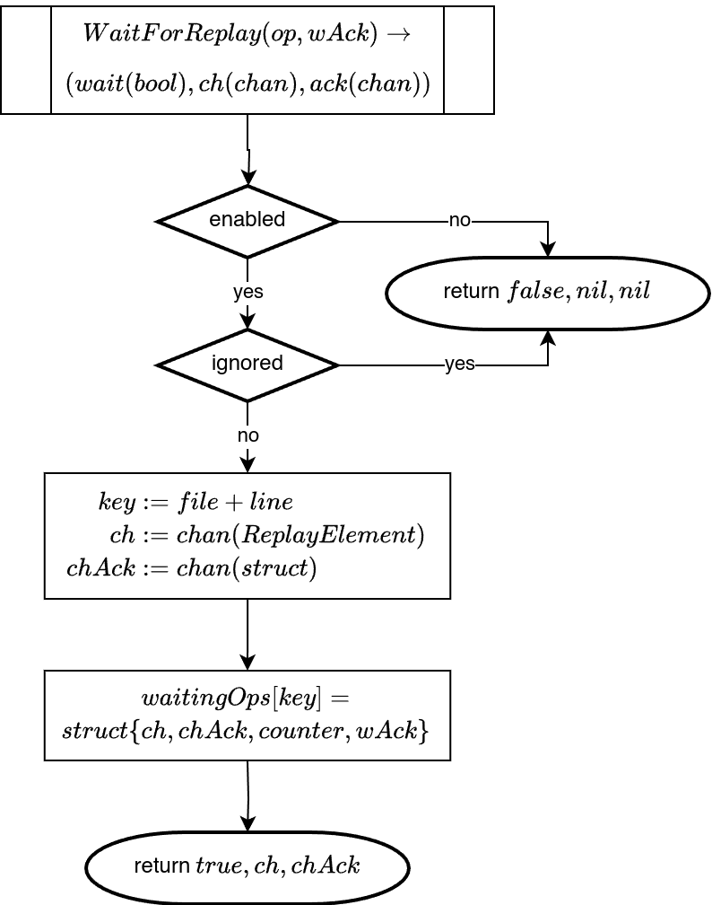

# Replay

Replay allows us to force the execution of a program to follow a given trace.

## Toolchain

The replay is run, if the test of main function starts with the following header:

  ```go
  advocate.InitReplay(index, exitCode, timeout, atomic)
  defer advocate.FinishReplay()
  ```

The parameters are as follows:

- `index` $\in \mathbb{N}$: The replay expects the name of the folder containing the trace to be called `advocateTrace`, in this case set `index = 0` or `rewritten_trace_[index]`, meaning if the trace folder is called `rewritten_trace_2`, set `index = 2`
- `exitCode` $\in \mathbb B$: currently always `false`<!-- TODO: currently always set to false, maybe remove -->
- `timeout` $\in \mathbb{N}$: If you want to cancel the replay with a timeout after a given time, set this value to the timeout in seconds. Otherwise set to `0`.
- `atomic`: If set to `true`, the replay will force the correct order of atomic events. If atomic operations should be ignored for the replay, set this to `false`.

When using the toolchain to run replays, this header is automatically added.


## Implementation
The following is a description of the current implementation of the trace replay.

The code for the replay is mainly in [advocate/advocate_replay.go](../go-patch/src/advocate/advocate_replay.go) and [runtime/advocate_replay.go](../go-patch/src/runtime/advocate_replay.go) as well as in the code
code implementation of all recorded operations.

[advocate/advocate_replay.go](../go-patch/src/advocate/advocate_replay.go) mainly contains the code to read in the trace and initialize the replay. When reading in the trace, all trace files are read. The internal representation of the replay consists of a `map[int][]ReplayElement` `replayData`. For each of the routines, we store a slice
of `ReplayElement`, meaning the list of elements in this routine.
The lists are sorted by the `tPost` time stamp. Each `ReplayElement`
represents one operation that is to be executed. It contains data about
the type of operation, the timestamp and the position of the operation
in the file. This position is used to connect the `ReplayElement` to the actual operation during the execution. Additionally it may contain
information about wether the operation is blocked, meaning it should start but never finish or wether it should execute successfully, e.g. for `once.Do` and `TryLock`. For selects, it also contains the internal
index of the case that should be executed.

[runtime/advocate_replay.go](../go-patch/src/runtime/advocate_replay.go) contains the functions for the actual order enforcement.\
The Order enforcements consists of three parts. First, we have the code in operations itself, that blocks the execution of the operation, until its released by the replay mechanism.\
The second part registers a function that wants to execute in the replay mechanism. The last part releases a waiting operation when it is the operations time to execute.

### Replay in operations
\
TODO: describe

## Register waiting operations

TODO: describe

## Release of waiting operations