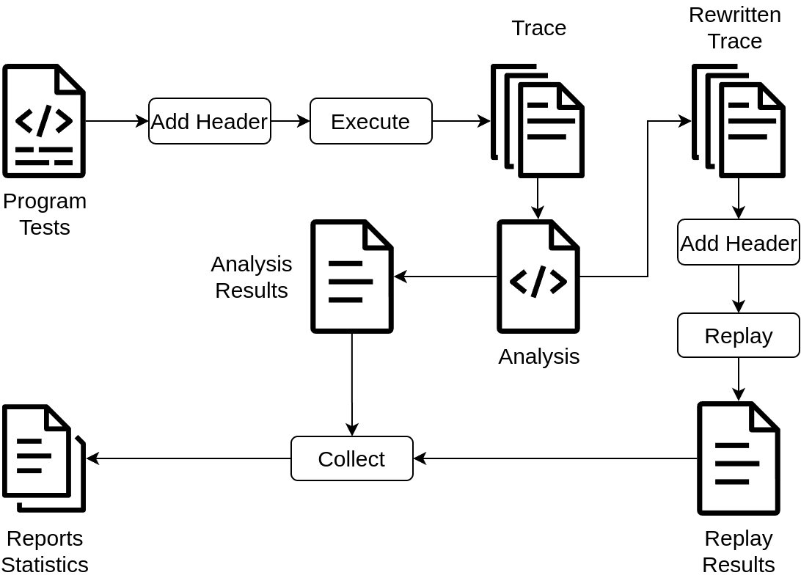

# Toolchain

The toolchain allow the user to analyze programs or tests.
It is integrated in the [analyzer](../analyzer).

The toolchain has tow modi, analysis and fuzzing.

## Analysis

Analysis will analyze a given program, test or set of tests.\
It can be specified if the analysis should be done on the main function of the
program, on on specific test or on all tests. If it is done on all tests, the
following is consecutively done for each test.\
The toolchain will first add a small header to the main or test function.
This header signals the runtime, that it is supposed to record the trace.
It will then use the modified go runtime to [run](recording.md) the test or program.
This will produce the trace files. The toolchain will then [analyze](analysis.md) those traces and write its result into different result files. If it detect bugs that
can be rewritten, it will create a [rewritten trace](replay.md) for each of those bugs.
It will then replay each of those rewritten traces, monitoring if the replay succeeded or not. The results of those replay will be saved in files.
At the end, the toolchain will collect all created traces and result files
and, based on them, will create report files for each bug that detail the
type and position of bug as well as the replay result, and multiple statistics
about the program and analysis.

## Fuzzing

Fuzzing will run a [fuzzing](fuzzing.md) approach on the tests. For this,
each test will be executed and analyzed multiple times. After each run and
analysis, the toolchain will determine if the recorded run was interesting.
For a detailed explanation of this see [here](fuzzing.md). If it was
interesting, it will create [mutations](fuzzing/mutations.md). Those mutation
specify preferred cases for selects and delays for some operations.
The toolchain will then run the full analysis again for each created mutations,
making sure that the specified restrictions are met. Each of those runs and
analyses can again create new mutations. The fuzzing will stop if no
new mutations are available, or if a predefined maximum of runs or runtime
is reached.