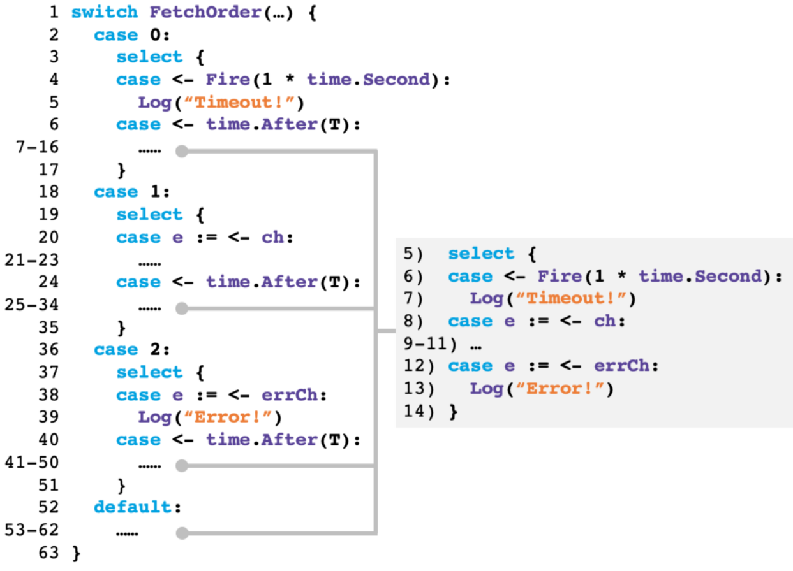

# Who goes first? detecting go concurrency bugs via message reordering

[Z. Liu, S. Xia, Y. Liang, L. Song, and H. Hu, “Who goes first? detecting go concurrency
bugs via message reordering,” in Proceedings of the 27th ACM International Conference on
Architectural Support for Programming Languages and Operating Systems, ser. ASPLOS
’22, Lausanne, Switzerland: Association for Computing Machinery, 2022, pp. 888–902, isbn:
9781450392051. doi: 10.1145/3503222.3507753. [Online]. Available: https://doi.org/10.1145/3503222.3507753](https://dl.acm.org/doi/10.1145/3503222.3507753)

## Summary

The tool created by the paper is called GFuzz. It focuses on
mutating the cases executed in selects. The basic idea lies in
setting a preferred case for each select. After executing it is checked, whether the run explored new operations. If so, the set of preferred cases is mutated, to get the next mutation run.

### Interesting

To calculate how often an schedule should be mutated, the following values are measured:

- CountChOpPair_i: For each pair i of send/receive, how often was it executed
- CreateCh: How many distinct channels have been created
- CloseCh: Number of closed channel
- MaxChBufFull: Maximum fullness for each buffer

From those, we can calculate the number of mutations as $$5 \cdot score/maxScore,$$ where the score is calculated as $$score = \sum\log_2 CountChOpPair + 10 \cdot CreateCh + 10 \cdot CloseCh + 10 \cdot \sum MaxChBufFull$$

### Mutation
Each of the selects in a program is assigned a unique id. Additionally each case in each select is also assigned an id.
A message order can then be represented as a sequence $[(s_0, c_0, e_0),...,(s_n, c_n, e_n)]$, where $s_i$ is the id of the select, $c_i$ the number of cases and $e_i$ the executed case index. For the mutation, GFuzz iterates over all elements in the sequence, setting the executed case to a random, but valid case.

### Order Enforcement
To enforce the cases in the select, the select cases in the program
code are directly modified.

As an example, the following select case

```go
select {
  case <- Fire (1 * time.Second):
    Log("Timeout!")
  case e := <-ch:
    ...
  case e := <-errCh:
    Log("Error!")
}
```

is instrumented as

<center></center>

The switch selects the case that should be executed. In each case of the switch, a select with two cases is implemented. On is a copy of the select case of the original select with the corresponding index.
The other is a timer case, containing the original select as its body.

This means, it works as follows. If the select has the case at index $i$ as its preferred case, it will create a select, which only waits for this specific case $i$. Additionally it has a timeout. If the timeout is reached, e.g. because the channel in the case has no possible partner, the complete original select is executed, allowing the program to continue without getting stuck.

### Bug detection
To detect blocking bucks, GFuzz first identifies a set of blocking routines whose `stGoIndo` indicate they are waiting for a synchronization operations. Then it inspects their blocking conditions to determine whether
they can be unblocked or not. For example, if a goroutine blocks
at a channel operation while no goroutines holding a reference
to the same channel are runnable now or in the future, then the
blocking goroutine cannot be unblocked anymore. Thus we detect
a blocking bug.